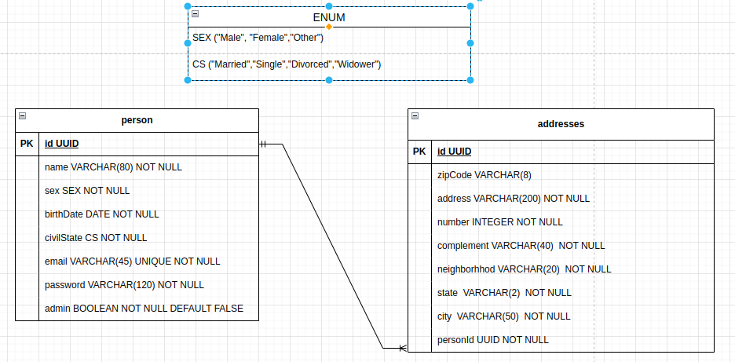

# desafio--api_ibs-sistemas-backend

<h1>API para cadastrar pessoas e seus respectivos endereços</h1>

<h3>Descrição da aplicação:</h3>

Esta API REST é responsável por cadastrar pessoas que podem ter muitos endereços associados. Nesta API, utilizei o PRISMA como ORM para fazer a interação com o banco de dados, s utilização de postgresql como banco de dados, json web token para gerar tokens criptografados, dotenv para proporcionar a segurança dos dados sensíveis,bcrypt js para executar o hash da senha  e nest.js com framework.

<h2>Endpoints da API:</h2>

| Método | Endpoint       | Descrição                                     | Autenticação e Autorização               |
| ------ | -------------- | --------------------------------------------- | ---------------------------------------- |
| GET    | /people      | Retorna todos as pessoas cadastrados            | Apenas administradores                   |
| GET    | /people/{id} | Retorna uma pessoa específicada pelo ID         | Admins e donos da conta                  |
| POST   | /people     | Cadastra uma nova pessoa                         | Qualquer cliente, token não é necessário |
| PATCH  | /people/{id} | Atualiza os dados de uma pessoa específico      | Admins e donos da conta                  |
| DELETE | /people/{id} | Exclui uma pessoa pelo ID                       | Admins e donos da conta                  |
| POST   | /login         | Gerar um token de autenticação                | qualquer cliente, token não é necessário |
| GET   | /people/id/addresses | Retorna todos os endereços vinculados a uma pessoa | admin e Donos da conta                           |
| POST   | /address      | Adiciona um novo endereço para uma pessoa       | Donos da conta                           |
| GET    | /address       | Lista todos os endereços das pessoas            | Apenas administradores                   |
| GET    | /address /{id} | Listar os endereços que pertencem a uma pessoa  | Admin e  donos da conta            |
| DELETE | /address /{id} | Deletar o endereço que pertence a uma pessoa    | Admin e  donos da conta            |
| PATCH  | /address/{id} | Atualizar o endreço que pertence a um cliente |   Admin e  donos da conta            |

## Diagrama de Entidades e Relacionamentos:

<h2>Algumas regras de negócio:</h2>
<ul>
<li>Pessoas não podem ser cadastrados com o mesmo e-mail</li>
<li>Esta API possui paginação</li>
<li>Quando um usuário é cadastrado, calcula-se a sua idade e quanto tempo falta para o próximo aniversário</li>
<li>Caso seja o aniversário,uma mensagem de parábens ira acontecer</li>
<li>Esta API possui autenticação e permissão</li>
<li>Esta API possui filtros de sexo,estado cívil, cidade, CEP e bairro. </li>
</ul>

<h2>Passos para a API rodar:</h2>

<ul>
<li>Clone o repositório de forma local</li>
<li>Utilize o comando npm install para instalar todas as dependências</li>
<li>Utilize o comando npx prisma migrate para rodar as migrações </li>
<li>npm run build</li>
<li>Para rodar o servidor, utilize o npm run start:dev</li>
<li>Para um melhor entendimento a respeito da API e de cada rota, acesse a documentação em https://desafio-api-ibs-sistemas-backend-1.onrender.com/api#/.
<li>Link do deploy: https://desafio-api-ibs-sistemas-backend-1.onrender.com//</li>
</ul>

## Contato

Alguma dúvida sobre o projeto ou deseja contribuir de alguma forma?

- bernardogvalim@gmail.com
- https://www.linkedin.com/in/bernardo-valim/
</html>

